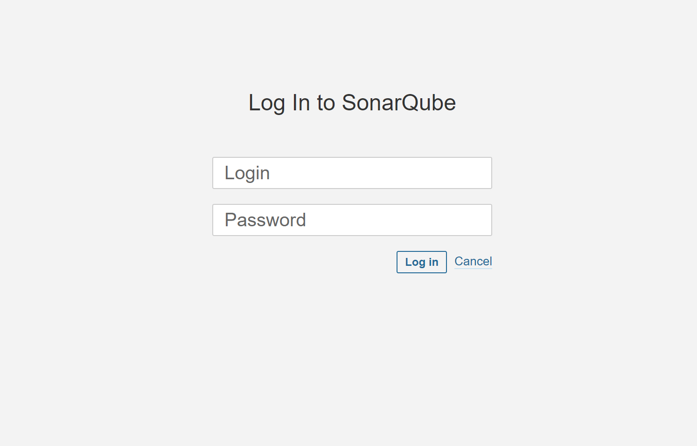
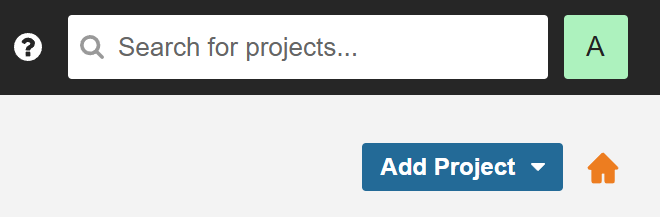
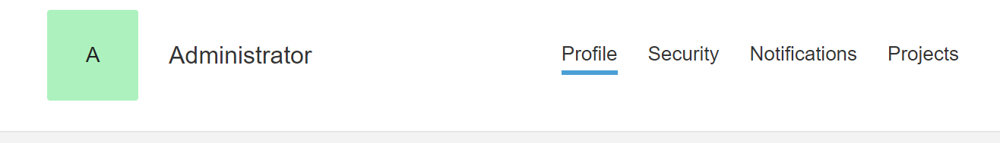
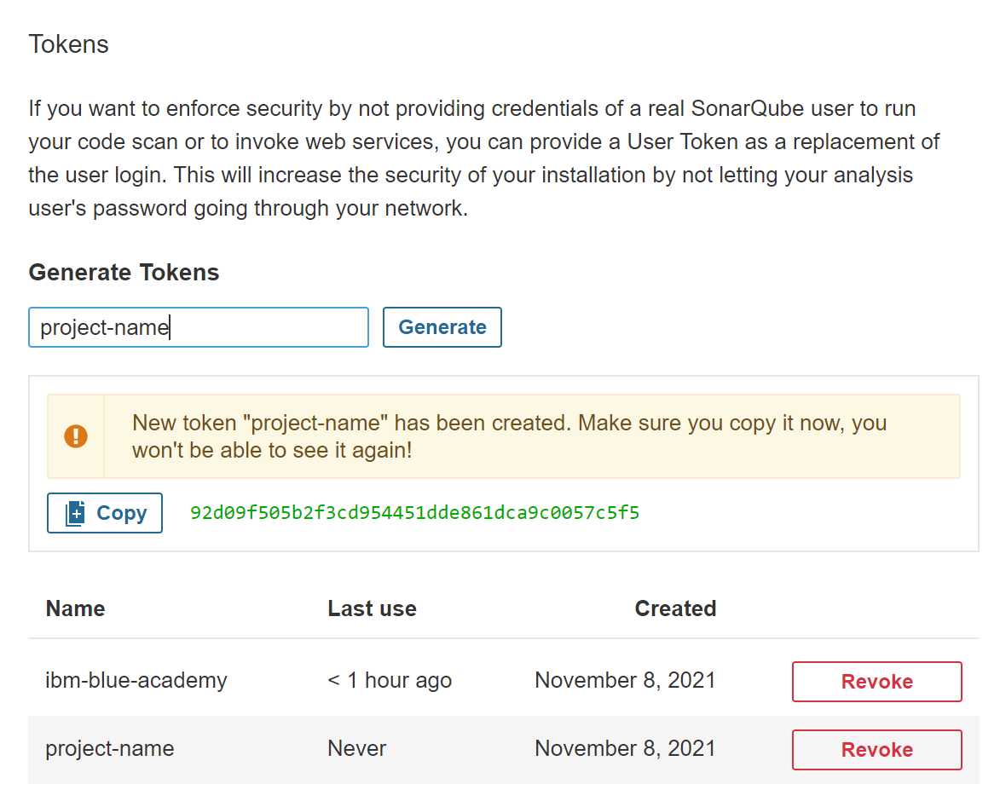
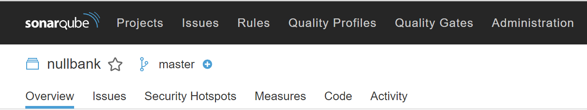
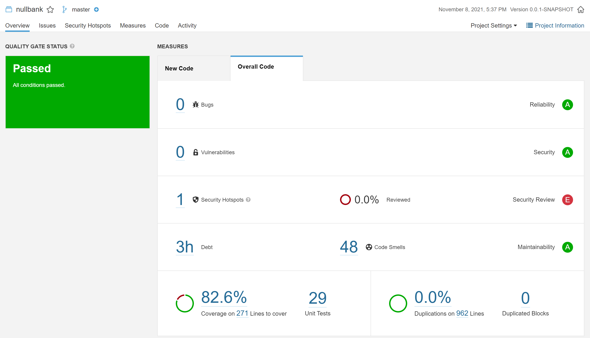

<!-- Badges -->
[blue-academy-badge]: https://img.shields.io/static/v1?label=IBM&message=Blue%20Academy&color=blue
[java-badge]: https://img.shields.io/static/v1?label=Java&message=11&color=blue
[spring-boot-badge]:  https://img.shields.io/static/v1?label=Spring%20Boot&message=2.5&color=blue

<!-- Images -->

<!-- Links -->
[blue-academy-url]: https://ibmblueacademy.corporate.gama.academy/
[java-url]: https://www.oracle.com/java/
[spring-url]: https://spring.io/


<!-- Content -->
# IBM Blue Academy | NullBank

[![IBM Blue Academy][blue-academy-badge]][blue-academy-url]
[![Java][java-badge]][java-url]
[![Spring][spring-boot-badge]][spring-url]


# Topics

- [Topics](#topics)
- [Curriculum](#curriculum)
- [NullBank](#nullbank)
- [Mission](#mission)
- [Activities](#activities)
- [Endpoints](#endpoints)
  - [Create Agency](#create-agency)
  - [New Client](#new-client)
  - [Open Account](#open-account)
  - [Deposit](#deposit)
  - [Cash Transfer](#cash-transfer)
  - [Transaction History](#transaction-history)
  - [List All Clients](#list-all-clients)
  - [Find Account](#find-account)
  - [Withdrawal](#withdrawal)
  - [List All Accounts](#list-all-accounts)
- [SonarQube](#sonarqube)

# Curriculum

The curriculum will touch on the following  subjects:

- Java
- Spring Boot
- Microservices
- Unit tests
- Rest APIs
- Among others

[Go to topics](#topics)

# NullBank

NullBank was born as a project for Gama Academy's Java Web Development course sponsored by IBM.

The object is to highlight the theoretical knowledge acquired in classes turning it into something substantial and practical.

Along with this project, it will be necessary to accomplish some activities to attest the acquired knowledge. The activities must strictly follow the statement.

[Go to topics](#topics)

# Mission

NullBank is the bank made by and for developers. It's possible to manage all your financial life with it.

It's possible to open current and saving accounts, do transfers, and much more!

[Go to topics](#topics)

# Activities

The features required for approval are:

- Registering clients
- Listing clients
- Cash transfer between accounts
- Transaction history

[Go to topics](#topics)

# Endpoints

Below are all the available endpoints.

## Create Agency

Endpoint to create an agency

Endoint:

```http

POST /agencies

```
Request:

```json
{
    "agencyName": "Central Agency",
    "agencyNumber": "0001"
}
```

Response:

```json
{
    "agencyName": "Central Agency",
    "agencyNumber": "0001"
}
```

[Go to topics](#topics)

## New Client

Endoint for creating a client.

Endpoint:

```http
POST /clients
```

Request:

```json
{
    "name": "Client 01",
    "address": "Address 01",
    "cpf": "606.344.610-95",
    "salary": "500.0"
}
```

Response:

```json
{
    "id": 2,
    "name": "Client 01"
}
```

[Go to topics](#topics)

## Open Account

Endpoint for opening an account after creating a client.

Endpoint:

```http
POST /accounts
```

Request:

```json
{
    "cpf": "606.344.610-95",
    "agencyNumber": "0001",
    "accountType": "CURRENT_ACCOUNT"
}
```

Response:

```json
{
    "agencyNumber": "0001",
    "agencyName": "Central Agency",
    "accountHolderName": "Client 01",
    "accountHolderId": 1,
    "accountNumber": "0000256938",
    "currentBalance": 0
}
```

[Go to topics](#topics)

## Deposit

Endpoint for depositing to an account.

Endpoint:

```http
POST /accounts/{ACCOUNT_NUMBER}/deposit
```

Request:

```json
{
    "amount": 1000
}
```

Response:

```json
{
    "agencyNumber": "0001",
    "agencyName": "Central Agency",
    "accountHolderName": "Client 01",
    "accountHolderId": 1,
    "accountNumber": "0000256938",
    "currentBalance": 1000.00
}
```

[Go to topics](#topics)

## Cash Transfer

Endpoint for transfering cash between accounts.

Endpoints:

```http
POST /accounts/{ORIGIN_ACCOUNT_NUMBER}/transfer-to/{DESTINATION_ACCOUNT_NUMBER}
```

Request:

```json
{
    "amount": 1000
}
```

Response:

```json
{
    "originAccountNumber": "0001664535",
    "destinationAccountNumber": "0001076192",
    "transferredAmount": 1000,
    "currentBalance": 0.00
}
```

[Go to topics](#topics)

## Transaction History

Endpoint for getting the transaction history.

Endpoint:

```http
GET /accounts/{{ACCOUNT_NUMBER}}/history
```

Response:

```json
{
    "accountNumber": "0001664535",
    "history": [
        {
            "amount": 1000.00,
            "description": "Deposit to account 0001664535"
        },
        {
            "amount": 1000.00,
            "description": "Transfer to account 0001076192"
        }
    ]
}
```

[Go to topics](#topics)

## List All Clients

Endpoint for listing clients.

Endpoint:

```http
GET /clients
```

Response:

```json
{
    "data": [
        {
            "id": 1,
            "name": "Client 01"
        }
    ]
}
```

[Go to topics](#topics)

## Find Account

Endpoint for finding account by account number.

Endpoint:

```http
GET /accounts/{ACCOUNT_NUMBER}
```

Response:

```json
{
    "agencyNumber": "0001",
    "agencyName": "Central Agency",
    "accountHolderName": "Client 01",
    "accountHolderId": 1,
    "accountNumber": "0001664535",
    "currentBalance": 0.00
}
```

[Go to topics](#topics)

## Withdrawal

Endpoint for withdrawal.

Endpoint:

```http
POST /accounts/{ACCOUNT_NUMBER}/withdraw
```

Request:

```json
{
    "amount": 1000
}
```

Response:

```json
{
    "agencyNumber": "0001",
    "agencyName": "Central Agency",
    "accountHolderName": "Client 01",
    "accountHolderId": 1,
    "accountNumber": "0001664535",
    "currentBalance": -1000.00
}
```

[Go to topics](#topics)

## List All Accounts

Endpoint for listing the available accounts.

Endpoint:

```http
GET /accounts
```

Response:

```json
{
    "data": [
        {
            "agencyNumber": "0001",
            "agencyName": "Central Agency",
            "accountHolderName": "Client 01",
            "accountHolderId": 1,
            "accountNumber": "0001076192",
            "currentBalance": 2000.00
        },
        {
            "agencyNumber": "0001",
            "agencyName": "Central Agency",
            "accountHolderName": "Client 01",
            "accountHolderId": 1,
            "accountNumber": "0001664535",
            "currentBalance": -1000.00
        }
    ]
}
```

[Go to topics](#topics)

# SonarQube

SonarQube is a tool for Code Static Analysis. For configuration, it's necessary to create a file 
called settings.xml in ~/.m2 folder.

File: ~/.m2/settings.xml

```xml
<settings xmlns="http://maven.apache.org/SETTINGS/1.0.0" xmlns:xsi="http://www.w3.org/2001/XMLSchema-instance"
  xsi:schemaLocation="http://maven.apache.org/SETTINGS/1.0.0 https://maven.apache.org/xsd/settings-1.0.0.xsd">
    <pluginGroups>
        <pluginGroup>org.sonarsource.scanner.maven</pluginGroup>
    </pluginGroups>
    <profiles>
        <profile>
            <id>sonar</id>
            <activation>
                <activeByDefault>true</activeByDefault>
            </activation>
        </profile>
     </profiles>
</settings>
```

1. For running this tool, you need to run the following Docker command:

```bash
docker run --name sonarqube -p 9000:9000 sonarqube:lts-community
```

2. Open the web browser and go to http://localhost:9000. The following image will open:



3. Type in admin for user and password.

4. In the top right side, click in the green button with an A.



5. Select My account and click on Security Tab.



6. Then, generate a token.



7. Type the following command:

```shell
mvn clean install sonar:sonar -D sonar.projectKey=nullbank  -D sonar.host.url=http://localhost:9000 -D sonar.login=<your token>
```

8. In the top left side, go to Projects -> Your Project.



Our current coverage is:



[Go to topics](#topics)
